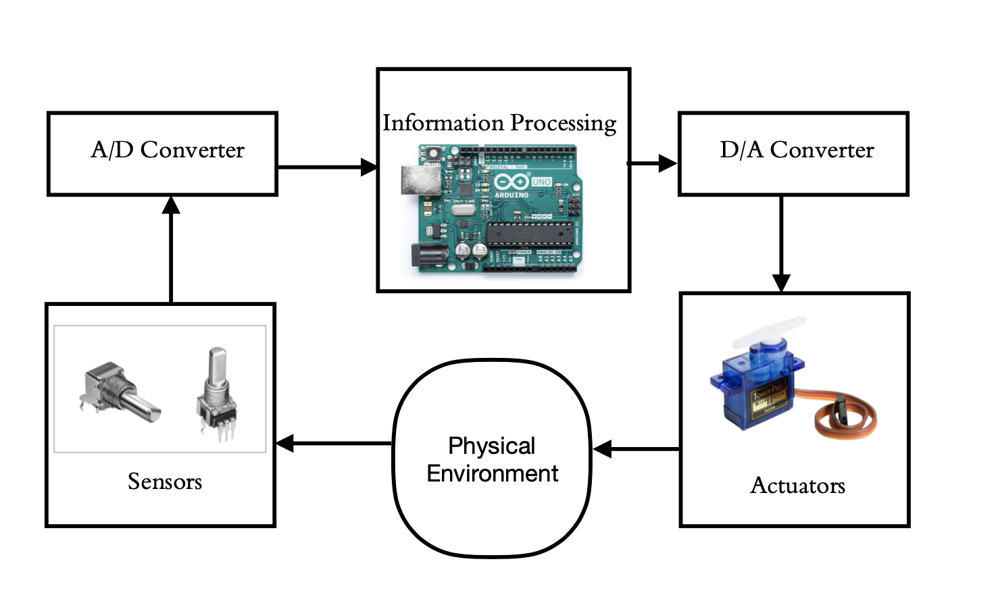
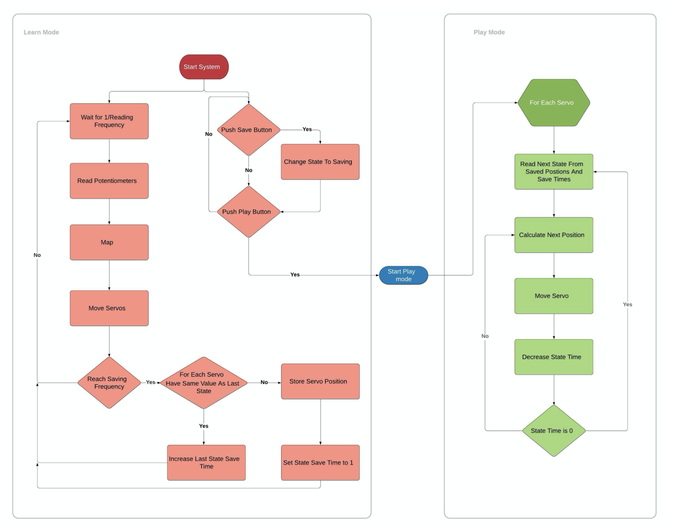

# RealTimeRoboticArm

Arduino code of RealTimeRobaticArm

## Demo : 

## Introduction 
This is the Real-time embedded systems course's main project. In this project, we created a real-time robotic arm with recording functionality. The main goal of this project was maximizing recording time according to the low value of the Arduino board's storage. We used some algorithms to reduce the size of storage usage. For a perspective, we increased 8s of recording (which is recording all positions of joints) to over 1 min. 

## Hardware in the Loop 

## Main Algorithm 

## Scheduling 
We used `Pure Time Trigger` approach to scheduling our tasks.
 